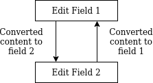
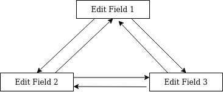

# FieldKonverter
**An easy Android Edit Text conversor that prevent loops made with Kotlin**

[](https://app.codacy.com/manual/AraujoJordan/FieldKonverter?utm_source=github.com&utm_medium=referral&utm_content=AraujoJordan/FieldKonverter&utm_campaign=Badge_Grade_Dashboard)
[](https://circleci.com/gh/AraujoJordan/FieldKonverter)
[](https://github.com/AraujoJordan/FieldKonverter/LICENSE)
[](https://jitpack.io/#AraujoJordan/FieldKonverter/0.0.4)

FieldKonverter is an android edit text converter that can be used for make operations between multiple edit fields. 
This can be easily used as a currency converter, link inverter, text replacement or any other type of conversion that you want to do with 2 or more fields. The entire project is made in Kotlin and have a small size and footprint.


## 🚀 Why use FieldKonverter?

When you are doing a conversion between two or multiple edit fields you will face this problem: How to prevent the contents between the fields enter in a conversion loop? And what about multiple edit fields?




You could implement from scratch or use this small library that will make your like much more easier. It can be used with kotlin lambdas to make a conversion between 2 fields with only 3 lines of code.    

## 📖 Usage

### For any type of conversion

```kotlin
// link inverter
FieldKonverter(editText,editText2) { from, to ->
    from?.text.toString().reversed()
}
```

### Example of multiple fields conversion

```kotlin
// translator (I use 3 in this example, but it could be N fields)
FieldKonverter(englishField,portugueseField,spanishField) { from, to ->
    when(from.id) {
        englishField.id -> {
            when(to.id) {
                portugueseField.id -> englishToPortuguese(from?.text) //return a string
                spanishField.id -> englishToSpanish(from?.text) //return a string
            }
        }
        portugueseField.id -> {
                when(to.id) {
                    englishField.id -> portugueseToEnglish(from?.text) //return a string
                    spanishField.id -> portugueseToSpanish(from?.text) //return a string
                }
        }
        spanishField.id -> {
             when(to.id) {
                englishField.id -> spanishToEnglish(from?.text) //return a string
                portugueseField.id -> spanishToPortuguese(from?.text) //return a string
            }
        }
    }
}
```


### For currency conversions
 
 You can use the `CurrencyKonverter` constructor to convert between two fields
 
```kotlin
CurrencyKonverter(
    CurrencyField(editText1, 0.5, 25000.00), //it will convert any content to half of its value
    CurrencyField(editText2, 2.0, 50000.00) //it will convert any content to double of its value
)
```

The third field of the CurrencyField is optional, so you can use something like: `CurrencyField(editText1, 2.0)`
You can even change the place decimal precision using the `CurrencyKonverter` variable `decimalPlaces` integer any time.

## 📦 Installation

#### Step 1. Add the JitPack repository to your project build file 

+ build.gradle (Project: YourProjectName)
```gradle
allprojects {
	repositories {
		maven { url 'https://jitpack.io' }
	}
}
```

#### Step 2. Add the dependency to your app build file 
+ build.gradle (Module: app) [](https://jitpack.io/AraujoJordan/FieldKonverter/)
```gradle
dependencies {
	implementation 'com.github.AraujoJordan:FieldKonverter:X.X.X'
}
```

## 📄 License
```
MIT License

Copyright (c) 2020 Jordan L. A. Junior

Permission is hereby granted, free of charge, to any person obtaining a copy
of this software and associated documentation files (the "Software"), to deal
in the Software without restriction, including without limitation the rights
to use, copy, modify, merge, publish, distribute, sublicense, and/or sell
copies of the Software, and to permit persons to whom the Software is
furnished to do so, subject to the following conditions:

The above copyright notice and this permission notice shall be included in all
copies or substantial portions of the Software.

THE SOFTWARE IS PROVIDED "AS IS", WITHOUT WARRANTY OF ANY KIND, EXPRESS OR
IMPLIED, INCLUDING BUT NOT LIMITED TO THE WARRANTIES OF MERCHANTABILITY,
FITNESS FOR A PARTICULAR PURPOSE AND NONINFRINGEMENT. IN NO EVENT SHALL THE
AUTHORS OR COPYRIGHT HOLDERS BE LIABLE FOR ANY CLAIM, DAMAGES OR OTHER
LIABILITY, WHETHER IN AN ACTION OF CONTRACT, TORT OR OTHERWISE, ARISING FROM,
OUT OF OR IN CONNECTION WITH THE SOFTWARE OR THE USE OR OTHER DEALINGS IN THE
SOFTWARE.
```

